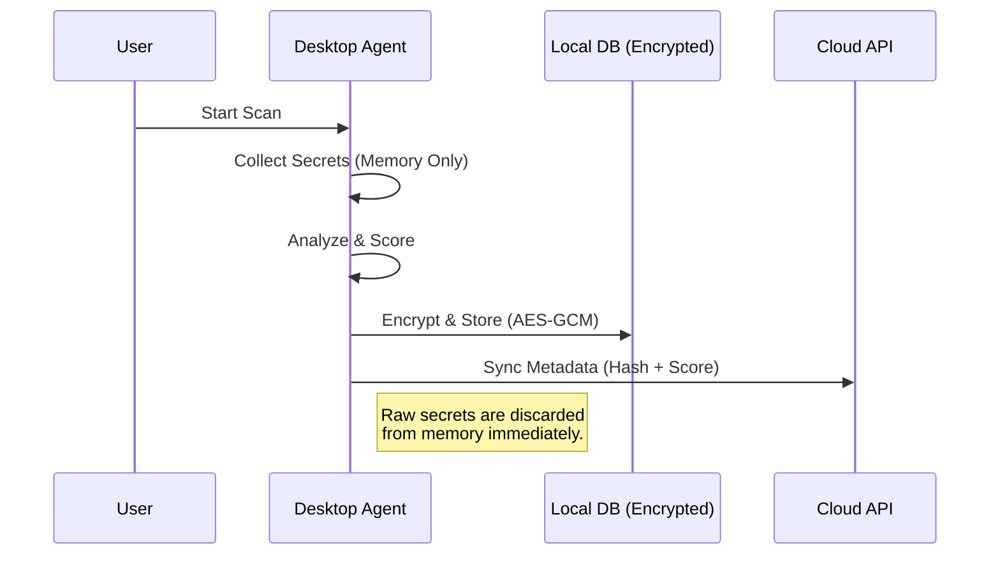

# 🛡️ AI Password & Credential Hygiene Assistant

> **A comprehensive, privacy-first security platform to detect, analyze, and remediate exposed secrets across your digital life.**
>
> **Developed by [ANAND BINU ARJUN](https://github.com/AnandBinuArjun)**


---

## 📖 Overview

The **AI Password & Credential Hygiene Assistant** is a hybrid security platform designed to identify weak, reused, or exposed credentials on your local machine. Unlike traditional password managers, this tool actively scans your **browsers, filesystem, git repositories, and environment configurations** to find secrets you might have forgotten about.

It operates on a **Local-First** architecture: all sensitive scanning and analysis happen on your device. Only encrypted metadata (risk scores, finding types) is synced to the optional Cloud Dashboard for fleet monitoring.

---

## ✨ Features

### 🖥️ Desktop Agent

* **Multi-Source Scanning**:
  * **Browsers**: Decrypts and analyzes passwords from Chrome, Edge, Brave, etc.
  * **Filesystem**: Scans files for regex patterns (AWS keys, private keys, API tokens).
  * **Git Repositories**: Deep scans working trees and commit history for buried secrets.
  * **Environment Configs**: Checks `~/.aws`, `~/.kube`, and other config files.
* **Advanced Detection**:
  * **Strength Analysis**: Uses `zxcvbn` to calculate entropy and crack time.
  * **Reuse Detection**: Identifies if the same password is used across multiple sites.
  * **Exposure Checks**: Flags secrets found in plain text files or git history.
* **AI-Powered Insights**:
  * Heuristic classification of secret types (e.g., "GitHub Token", "Slack Key").
  * Risk scoring (0-100) based on multiple factors.

### ☁️ Cloud & Mobile

* **Centralized Dashboard**: Aggregate risk scores from multiple devices.
* **Mobile App**: Monitor your security posture on the go (Android/iOS).
* **Privacy-Preserving Sync**: Only metadata and hashes are synced; **raw secrets never leave your device**.

---

## 🏗️ System Architecture

The system consists of three main components:

1. **Desktop Agent (The Core)**:
    * **Backend**: Python (FastAPI) service that runs collectors and analysis.
    * **Frontend**: React + Tauri application for the user interface.
    * **Storage**: Encrypted local SQLite database.
2. **Cloud Backend**:
    * **API**: FastAPI service for aggregation.
    * **DB**: PostgreSQL for storing fleet data.
3. **Mobile App**:
    * **Frontend**: React Native (Expo) app connecting to the Cloud API.

### 📊 Flowcharts

**1. Scanning Pipeline**

```mermaid
graph LR
    A[Start Scan] --> B{Collectors}
    B -->|Browsers| C[Raw Findings]
    B -->|Filesystem| C
    B -->|Git| C
    C --> D[Normalization]
    D --> E[Detection Layer]
    E --> F[Strength & Reuse]
    E --> G[Risk Scoring]
    G --> H[AI Classification]
    H --> I[Encrypted DB]
    I --> J[Cloud Sync (Metadata Only)]
```

**2. Security Model**



---

## 📂 Directory Structure

```
ai-credential-hygiene/
├── backend/                  # 🧠 Python Core Service
│   ├── core/                 # Orchestration & Config
│   ├── collectors/           # Scanning Modules (Browser, File, Git)
│   ├── detect/               # Analysis Logic (Strength, Reuse)
│   ├── security/             # Crypto & Key Management
│   ├── storage/              # Local SQLite DB
│   └── api/                  # Local API Server
├── ui/                       # 🎨 Desktop Frontend (React + Tauri)
├── cloud/                    # ☁️ Cloud Backend (Dockerized)
│   ├── backend/              # Cloud API
│   └── docker-compose.yml    # Deployment Config
├── mobile/                   # 📱 Mobile App (React Native)
├── tests/                    # 🧪 Unit Tests
└── scripts/                  # 📦 Packaging Scripts
```

---

## 🚀 How It Works

1. **Collection**: The agent queries OS-specific stores (like Windows DPAPI for Chrome) and walks the filesystem looking for high-entropy strings and known patterns (regex).
2. **Normalization**: All findings are converted to a standard format. The raw secret is hashed (SHA-256) for comparison.
3. **Analysis**:
    * **Strength**: `zxcvbn` estimates how hard the password is to guess.
    * **Reuse**: The hash is compared against all other findings in the DB.
    * **Context**: The location (e.g., `Desktop/passwords.txt`) is evaluated for risk.
4. **Storage**: The finding is saved to SQLite. Sensitive fields (preview, username) are encrypted using a master key derived from the OS keychain or a local key file.
5. **Sync**: If configured, the agent sends the *hash* and *risk score* to the cloud.

---

## 🛠️ Installation

### Prerequisites

* **Python 3.9+**
* **Node.js 16+**
* **Rust** (for Tauri)
* **Docker** (optional, for Cloud)

### 1. Desktop Agent (Local)

**Backend Setup:**

```bash
# Clone the repo
git clone https://github.com/anandbinuarjun/ai-credential-hygiene.git
cd ai-credential-hygiene

# Install Python dependencies
pip install -r requirements.txt
```

**Frontend Setup:**

```bash
cd ui
npm install
```

### 2. Cloud Backend (Optional)

```bash
cd cloud
docker-compose up -d --build
```

### 3. Mobile App (Optional)

```bash
cd mobile
npm install
npx expo start
```

---

## ▶️ Usage

### Running the Desktop App

1. **Start the Backend**:

    ```bash
    python run_backend.py
    ```

2. **Start the UI**:

    ```bash
    cd ui
    npm run tauri dev
    ```

### Triggering a Scan

You can trigger a scan from the UI or via the local API:

```bash
curl -X POST http://127.0.0.1:8000/scan/start
```

### Viewing Findings

```bash
curl http://127.0.0.1:8000/findings
```

---

## 🔒 Security Model

We take security seriously. Here is how we protect your data:

1. **Local-First**: Your secrets never leave your machine.
2. **Encryption at Rest**: The local database is encrypted using **AES-GCM**. The master key is protected using OS-level security (Windows DPAPI).
3. **Memory Safety**: Raw secrets are kept in memory only for the duration of the analysis and are explicitly cleared/garbage collected.
4. **Privacy Sync**: The cloud component only receives **SHA-256 hashes** and metadata. It is mathematically impossible for the cloud server to reconstruct your passwords from this data.

---

## 🗺️ Roadmap

* [x] **v0.1**: Core Collectors (Browser, File, Git), Local DB, Basic UI.
* [x] **v0.2**: Cloud Sync & Mobile Dashboard.
* [ ] **v0.3**: Real-time file watching (auto-scan on file save).
* [ ] **v0.4**: Active Remediation (auto-rotate AWS keys).
* [ ] **v0.5**: Enterprise SSO & RBAC for Cloud Dashboard.

---

## 🤝 Contributing

Contributions are welcome! Please follow these steps:

1. Fork the repository.
2. Create a feature branch (`git checkout -b feature/amazing-feature`).
3. Commit your changes.
4. Push to the branch.
5. Open a Pull Request.

---

## 📄 License

Distributed under the MIT License. See `LICENSE` for more information.
